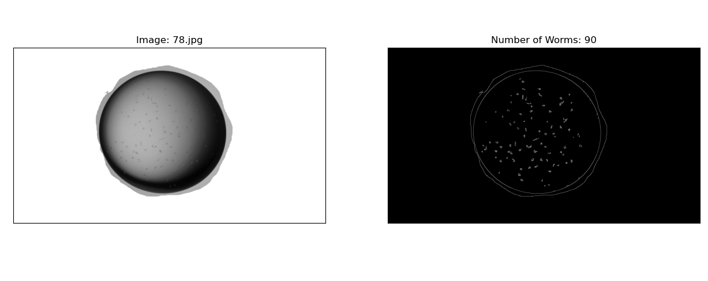

# Worm-Counting
Worm Counting in Biomedical Application.

## Requirements
- Python 3.6
- OpenCV

## Installations
### 1. Installing Python 3.6
Download and install python3.6
- Download [here](https://www.python.org/downloads/release/python-3610/)
- Install tutorial [here](https://www.pytorials.com/python-download-install-windows/)

### 2. Installing pip
Open cmd and run the command:
```bashrc
python get-pip.py
```

### 3. Installing Necessary Libs
- Install OpenCV
```bashrc
python -m pip install opencv-python
```
- Install Matplot Lib
```bashrc
python -m pip install matplotlib
```

## Usage
The application can be run by executing: 
```bashrc
python counting_app.py
```

## Results



April 2020

Tran Le Anh
